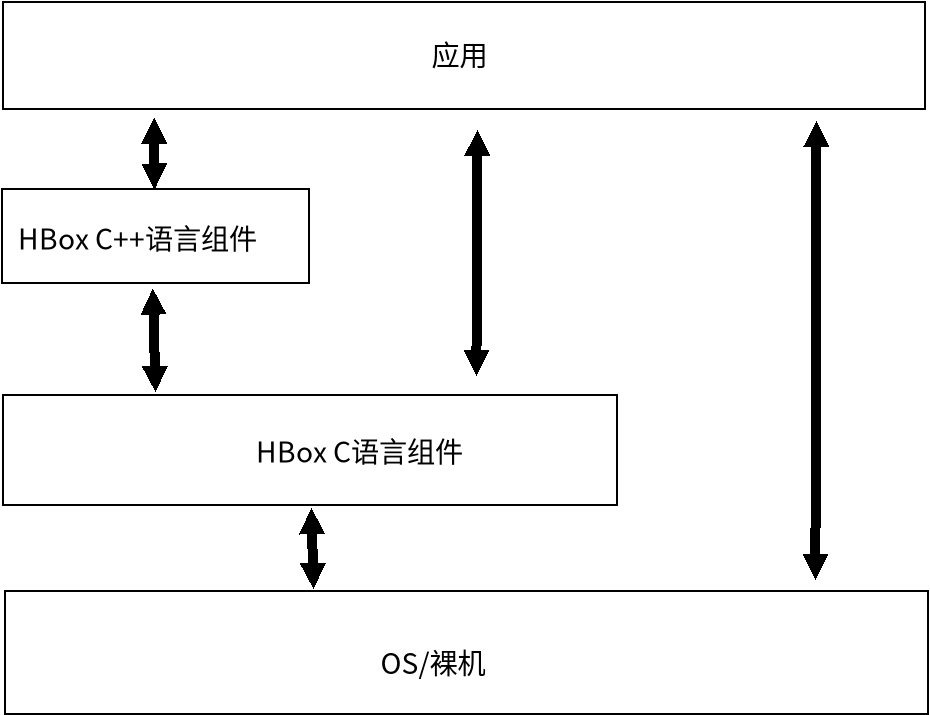

# 说明

hbox意为HYH的工具箱。

实现一些在开发过程中的常用函数及相关结构。

主要用于嵌入式编程，通常只依赖于C运行库与部分OS接口,尽量使用较少的依赖以适应各种编译环境。

# 硬件要求

主要支持32位及更高位宽的硬件平台,包括但不限于嵌入式硬件平台:

- 32位通用硬件平台
- 32位嵌入式硬件平台(如单片机等)
- 64位通用硬件平台
- 64位嵌入式硬件平台

8位/16位平台的C编译器基本有其独特的扩展，C语言代码专用性比较强，如需使用相关组件，一般需要进行一些针对性适配。

# 宏定义

本章节所指宏定义主要指用户传递的宏定义，并非组件内部的宏定义。

宏定义通常是通过编译器命令行参数传递的,也可能是编译器预定义的,也可通过特殊的头文件(如config.h)定义。

不同的宏定义将触发不同的行为。

|        宏定义         |                             说明                             |                             备注                             |
| :-------------------: | :----------------------------------------------------------: | :----------------------------------------------------------: |
|    `__RTTHREAD__`     |                    处于RT-Thread操作系统                     |                     RT-Thread 4.0.3+有效                     |
|      `__NuttX__`      |                      处于NuttX操作系统                       |                                                              |
|        `WIN32`        |                        处于windows中                         |                                                              |
|      `__unix__`       |                        处于(类)unix中                        | 若处于linux中，可使用`__linux__` 判断。在(类)unix中将使用pthread及其相关库（有些可能需要手动启用）。 |
|      `__linux__`      |                         处于linux中                          |         通常也会定义`__unix__`，即处于(类) unix中。          |
|     `__ANDROID__`     |                        处于Android中                         | 通常也会定义`__unix__`、`__linux__`，即处于(类) unix、linux中。 |
|     `__CYGWIN__`      |                         处于Cygwin中                         |         通常也会定义`__unix__`，即处于(类) unix中。          |
|   `__EMSCRIPTEN__`    |                       处于emscripten中                       |         通常也会定义`__unix__`，即处于(类) unix中。          |
| `__STDC_NO_ATOMICS__` | 当此宏定义被定义时，C不包含`_Atomic`原子类型名,即不支持原子操作。 |                            C11起                             |
|    `HAVE_CONFIG_H`    |          `config.h`存在,当定义存在时包含`config.h`           |                    此宏定义一般由用户定义                    |
| `HBOX_CONFIG_HEADER`  | `HBOX_CONFIG_HEADER`表示hbox的配置文件路径(不含引号)，若定义将由hdefaults包含该配置文件。 |                    此宏定义一般由用户定义                    |

# C++组件

此C++组件主要用于嵌入式代码,一般不依赖某些在嵌入式中一般不移植的C++运行库(如线程、互斥等),依赖于本工具箱的C代码。

此C++组件具体实现与说明见[cpp](cpp)目录。

# 组件

## hcompiler

主要提供一些编译器相关特性的宏定义。

|         宏定义         |      说明      | 备注                                                         |
| :--------------------: | :------------: | :----------------------------------------------------------- |
|        `__ASM`         |      汇编      | 注意：一般用于裸机开发或者RTOS开发,通用平台可能无此定义。    |
|       `__INLINE`       |      内联      |                                                              |
|   `__STATIC_INLINE`    |    静态内联    |                                                              |
| `__STATIC_FORCEINLINE` |  静态强制内联  | 注意:某些平台下同`__STATIC_INLINE`                           |
|     `__NO_RETURN`      |     无返回     | 注意：某系平台可能此定义为空（不起作用）。                   |
|        `__USED`        |  标记已被使用  | 注意：某系平台可能此定义为空（不起作用）。                   |
|        `__WEAK`        |     弱定义     | 一般用于库函数编写。注意:在gcc中必须指定`-Wl,--whole-archive`才能确保库的弱定义一定生效,某系平台可能此定义为空（不起作用）。 |
|       `__PACKED`       |  取消对齐优化  | 注意：某系平台可能此定义为空（不起作用）。                   |
|      `__ALIGNED`       |    对齐设置    | 注意：某系平台可能此定义为空（不起作用）。                   |
|      `__RESTRICT`      | restrict限定符 |                                                              |
|      `__NO_INIT`       |  不进行初始化  | 通常用于支持SRAM在复位时不复位的单片机使用。可减少异常复位带来的数据损失。注意：一般用于裸机开发或者RTOS开发,通用平台可能无此定义。 |
|       `__ALIAS`        |      别名      | 注意：某系平台可能此定义为空（不起作用）。                   |
|      `__SECTION`       |     设置节     | 通常配合链接脚本使用。注意：某系平台可能此定义为空（不起作用）。 |

## hdefaults

本组件主要提供一些定义及函数。

本组件主要用于提供统一访问OS接口的接口,其它组件一般不直接与OS接口打交道。

一般情况下，一个MCU（不带MMU/MPU）基本工程只有一个程序。

但在某些情况下，需要把一个MCU(不带MMU/MPU）程序分为多个部分（通常是基于许可或者保密要求），每个部分可单独开发，此时可使用本组件的`usercall`+API表的机制（以分为Kernel与App两部分为例，启动App程序时，将API表设置为Kernel的API表，此时App可通过`usercall`访问Kernel的资源）。

本工具箱的可移植部分通常在本组件中进行。

提供的函数如下：

|                             函数                             |      说明      |                             备注                             |
| :----------------------------------------------------------: | :------------: | :----------------------------------------------------------: |
|         `hdefaults_tick_t hdefaults_tick_get(void)`          |  默认节拍获取  |                                                              |
|     `void * hdefaults_malloc(size_t nBytes,void *usr);`      |  默认内存分配  |                                                              |
|         `void hdefaults_free(void *ptr,void *usr);`          |  默认内存释放  |                                                              |
|           `void  hdefaults_mutex_lock(void *usr);`           | 默认互斥锁加锁 | 通常在实现时使用临界区实现,如需使用互斥锁，必须使用支持递归的互斥锁 |
|          `void  hdefaults_mutex_unlock(void *usr);`          | 默认互斥锁解锁 | 通常在实现时使用临界区实现，如需使用互斥锁，必须使用支持递归的互斥锁 |
| `const hdefaults_api_table_t * hdefaults_get_api_table(void);` |   获取API表    |                                                              |
| `const hdefaults_api_table_t * hdefaults_set_api_table(const hdefaults_api_table_t* new_api_table);` |   修改API表    |               一般情况下，只在程序初始化时调用               |
|          `hdefaults_usercall(usercall_number,...)`           |    用户调用    |           一般不直接使用，用于封装`usercall`调用。           |

提供的宏定义如下:

|          宏定义           | 说明                             | 备注                                                         |
| :-----------------------: | :------------------------------- | :----------------------------------------------------------- |
|    `hdefaults_xstr(s)`    | 宏函数,将符号s的内容转换为字符串 |                                                              |
|    `hdefaults_str(s)`     | 宏函数,将符号s转换为字符串       |                                                              |
|  `HDEFAULTS_OS_RTTHREAD`  | 处于RT-Thread中                  |                                                              |
|   `HDEFAULTS_OS_NUTTX`    | 处于NuttX中                      |                                                              |
|  `HDEFAULTS_OS_WINDOWS`   | 处于Windows中                    |                                                              |
|    `HDEFAULTS_OS_UNIX`    | 处于UNIX(类UNIX中)               |                                                              |
|   `HDEFAULTS_OS_LINUX`    | 处于Linux中                      | 通常也会定义`HDEFAULTS_OS_UNIX`                              |
|  `HDEFAULTS_OS_ANDROID`   | 处于Android中                    | 通常也会定义`HDEFAULTS_OS_UNIX`、`HDEFAULTS_OS_LINUX`        |
|   `HDEFAULTS_OS_CYGWIN`   | 处于Cygwin中                     | 通常也会定义`HDEFAULTS_OS_UNIX`                              |
| `HDEFAULTS_OS_EMSCRIPTEN` | 处于emscripten中                 | 通常也会定义`HDEFAULTS_OS_UNIX`                              |
|    `HDEFAULTS_OS_NONE`    | 无操作系统                       | 通常为裸机开发，也可用于某些SDK中裸机应用开发（有操作系统但应用不可见，且无MMU/MPU内存管理的情况）。 |
|  `HDEFAULTS_LIBC_NEWLIB`  | C库采用Newlib                    | Newlib常用于裸机开发。与常见的C库不同，通常情况下，用作裸机开发时需要用户移植部分系统调用。Newlib也被用于[Cygwin](https://cygwin.com/)与[MSYS2](https://www.msys2.org/)，此环境下无需用户进行移植。 |
| `HDEFAULTS_LIBC_PICOLIBC` | C库采用picolibc                  | [picolibc](https://github.com/picolibc/picolibc)是一个为32位/64位嵌入式系统设计的C库。其混合了Newlib与AVR libc,故而一般也会定义`HDEFAULTS_LIBC_NEWLIB`。 |
|  `HDEFAULTS_LIBC_MINGW`   | C库采用mingw                     | mingw通常采用[mingw-w64](https://www.mingw-w64.org/)版本，常用于Windows(或者兼容环境如[Wine](https://www.winehq.org/))。使用GCC/LLVM编译Windows程序时通常使用此C库。与其作用类似的为MSVC的C库。 |
|   `HDEFAULTS_LIBC_MSVC`   | C库采用MSVC自带C库。             | 一般用于Windows程序。                                        |
|  `HDEFAULTS_LIBC_GLIBC`   | C库采用glibc                     | [glibc](https://www.gnu.org/software/libc/)是大多数Linux发行版采用的C库。与其作用类似的为[musl](http://musl.libc.org/)、uClibc。一般在Linux操作系统环境下，若未采用glibc，大概率采用musl或uClibc作为C库。 |
|   `HDEFAULTS_LIBC_MUSL`   | C库采用musl                      | [musl](http://musl.libc.org/)通常用于轻量级场景（如容器、嵌入式Linux），其体积一般相较glibc小，但其某些行为可能与glibc不同。 |
|  `HDEFAULTS_LIBC_UCLIBC`  | C库采用uClibc                    | uclibc常采用[uClibc-ng](https://uclibc-ng.org/)版本。uClibc是一个用于嵌入式Linux系统的C库，其体积较小。通常也会定义`HDEFAULTS_LIBC_GLIBC` |
| `HDEFAULTS_LIBC_ARMCLIB`  | C库采用ARM Compiler的C库         | ARM Compiler常见于Keil MDK。一般用于ARM架构的MCU开发。       |
|   `HDEFAULTS_LIBC_ICC`    | C库采用IAR的C库                  | IAR是一种开发工具。ARM IAR可用于ARM架构的MCU开发。           |

可外部配置的宏定义如下:

|          宏定义          |                             说明                             |                             备注                             |
| :----------------------: | :----------------------------------------------------------: | :----------------------------------------------------------: |
|   `HDEFAULTS_TICK_GET`   |               默认获取节拍(毫秒)函数名称宏定义               |                                                              |
|    `HDEFAULTS_MALLOC`    |                  默认内存分配函数名称宏定义                  |                                                              |
|     `HDEFAULTS_FREE`     |                  默认内存释放函数名称宏定义                  |                                                              |
|  `HDEFAULTS_MUTEX_LOCK`  | 默认互斥锁加锁函数(无参数，无返回值)名称宏定义,要求锁支持递归。 | 一般用于嵌入式编程,一般使用临界区实现。对于无操作系统的环境,可采用计数+开中断的方式实现(参考rt-thread)。 |
| `HDEFAULTS_MUTEX_UNLOCK` | 默认互斥锁解锁函数(无参数，无返回值)名称宏定义，要求锁支持递归。 | 一般用于嵌入式编程,一般使用临界区实现。对于无操作系统的环境,可采用计数+关中断的方式实现(参考rt-thread)。 |

##  hevent

本组件主要用于辅助进行事件处理。

具体实现见[hevent](hevent)目录

## hdriverframework

本组件主要用于辅助进行驱动编写。

具体实现见[hdriverframework](hdriverframework)。

## hmemory

本组件主要用于辅助进行内存管理。

具体实现见[hmemory](hmemory)目录

## hlocale

本组件主要用于辅助处理区域设置(如字符编码等)。

具体实现见[hlocale](hlocale)目录

## hstacklesscoroutine

本组件用于辅助编写简易无栈协程。无栈协程可用于实现简易的多任务系统。

具体实现见[hstacklesscoroutine](hstacklesscoroutine)。

## hmodbus

本组件用于辅助实现[modbus](https://modbus.org)。

具体实现见[hmodbus](hmodbus)目录

## h3rdparty

有很多成熟的第三方库也适合本库的应用场景，在此模块上添加这些库。

具体实现见[h3rdparty](h3rdparty),由于第三方源代码(有些静态变量、宏定义会冲突)不能直接放在一个C源代码中，[h3rdparty](h3rdparty)中的文件应当添加至构建的源代码列表。

## hgui

在嵌入式场景中辅助实现GUI界面。

实现在GUI界面中一些常用的功能,提供一些接口模板。

具体实现见[hgui](hgui)目录

## hsimulator

辅助实现一些可在嵌入式平台(如MCU)上运行的模拟器。

具体实现见[hsimulator](hsimulator)。

模拟器相对真机的优点是可轻松控制运行状态（监控、复位、调试、升级等），缺点是一般来说模拟器的性能不如真机。

如果是物联网应用，模拟器还可远程控制运行状态。

## hshell

 通常用于运行简易命令，通常用于调试。

具体实现见[hshell](hshell)目录。

使用本组件实现的shell推荐使用支持终端转义序列的软件（如[putty](https://www.chiark.greenend.org.uk/~sgtatham/putty/)、minicom）打开，不推荐直接使用串口调试工具打开。

## huuid

辅助处理UUID。

具体实现见[huuid](huuid)目录。

## hcrypto

加密组件。

一般提供软件实现的加密算法及校验算法。

具体实现见[hcrypto](hcrypto)目录。

## hruntime

处理各个C语言组件的初始化及任务循环。

可外部配置的宏定义如下:

|            宏定义             |     说明     |                      备注                       |
| :---------------------------: | :----------: | :---------------------------------------------: |
| `HRUNTIME_USING_INIT_SECTION` | 启用初始化段 | 当`hruntime_init`被调用时将调用初始化段中的函数 |
| `HRUNTIME_USING_LOOP_SECTION` |  启用循环段  |  当`hruntime_loop`被调用时将调用循环段中的函数  |
